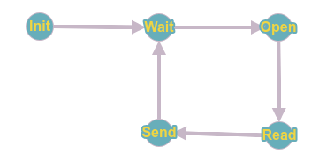

# Субдиректория для хранения выполенных заданий по курсу Erlang\Elixir от Eltex за версию от 2018 года (задания получены от Майорова Станислава)

# ELTEXErlang
Курс Летней школы ЭЛТЕКС 2018 (язык Erlang)

Задания для каждого занятия помещены в соответствующие папки.
<b>Например</b>, задания с занятия №1 находится в папке ex1/.

## Список заданий:
* Занятие 1.

1) Установить компилятор языка Erlang и REBAR.
2) Опробовать модули io и math.
3) Создать свой модуль, демонстрирующий полученные знания.

* Занятие 2.

1) Написать свои функции возведения в степень и факториала.
2) Написать функцию подсчета средств на счетах списка пользователей-записей.
3) Разработать функцию, превращающую каждый 3-й элемент списка в -1.
4) Написать функцию обращения списка.
5) Реализовать функцию Аккермана.

* Занятие 3.

Разработать функции для работы с телефонным справочником, основанном на map'ах.

* Занятие 4.

1) Сравнить время работы самодельных функций, вычисляющих факториал, основанных на обычной и хвостовой рекурсии.
2) Сравнить время работы самодельных функций, вычисляющих быструю сортировку, основанных на обычной и хвостовой рекурсии.

* Занятие 5.

1) Написать макрос, вычисляющий степень числа.
2) Связать 2 узла, отправить от одного другому запрос, обработать его и отправить ответ обратно.

* Занятие 6.

Имеется файл, содержащий некоторое число.

1) Сделать функцию, возвращающую это число и запустить её на другом узле с помощью RPC.
2) Написать конечный автомат, который делает тоже самое, со структурой, представленной ниже. Запустить Init с помощью spawn().

* Занятие 7.

1) Сделать UDP- и TCP- клиентов и серверы. В одних использовать активный режим передачи сообщений, в других - пассивный.
2) Создать HTTP-сервер, отправляющий на GET-запрос HTML-страницу.

* Занятие 8.

Разработать приложение (Application) с супервизором и несколькими рабочими (worker'ами), являющимися web-серверами. Попробовать различные виды перезапуска (one-for-one и т.п.). Использовать Яндекс.Танк или аналогичные сервисы, чтобы "уронить" сервер. (выполнено частично)

* Занятие 10.

Написать функцию получения информации о пользователе ВКонтакте с VK API и jiffy.

* Занятие 11.

Написать приложение для проверки "теории 6 рукопожатий". Собрать его с помощью RELX так, чтобы оно собиралось на последнем ядре процессора.

* Занятие 12.

Написать маленькие приложения, иллюстрирующие работу 3-х принципов дизайна ОТП: gen_server, gen_fsm и gen_event.
Сервер должен отвечать на заявки текущей датой, автомат - имитировать телефон, а эвенты - логировать сообщения. (выполнено частично)

* Занятие 14.

1) Написать небольшую программу, иллюстрирующую работу с C Nodes.
2) Написать небольшую программу, иллюстрирующую работу с NIF.
3) Разработать бота, отвечающего от имени сообщества ВК аудиоверсией сообщений, которые ему шлют.

* Занятие 15.

Протестировать функции из занятия 2 с помощью юнит-тестов, сделать тест выброса исключения в случае деления на ноль.

* Занятие 18.

1) С помощью библиотеки nksip и докер-контейнера с установленным на нем Asterisk'ом сделать сервер, работающий с запросами REGISTER и INVITE.
2) С помощью библиотеки rtplib послать RTP-пакет с wav-сообщением на Linphone (Задание "со звездочкой").

* Занятие 19.

Написать конечный автомат, представленный ниже, с помощью statem. Подключить к нему логгирование с помощью chronica (Chronica не работает).

